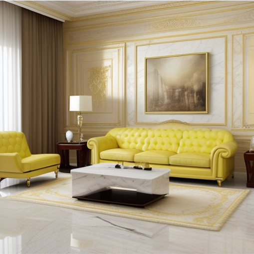
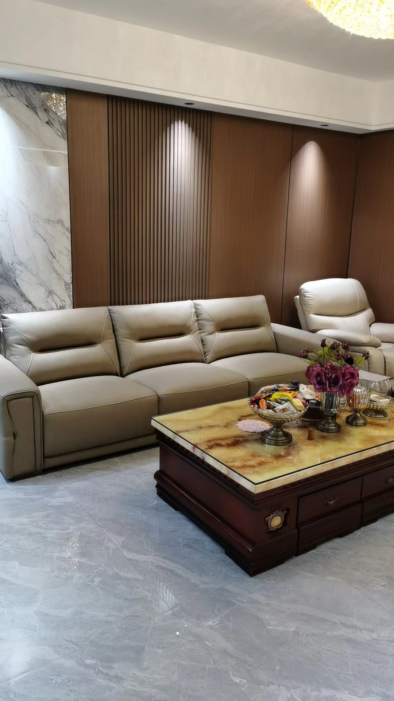
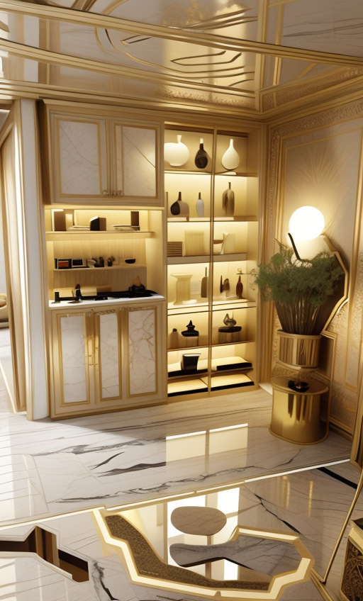
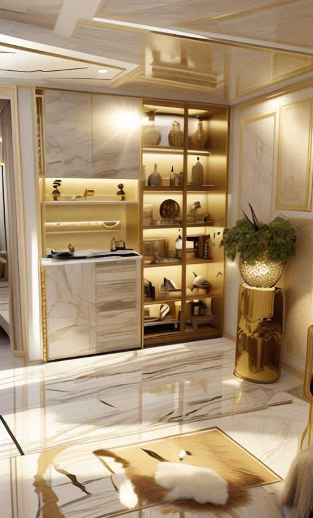

# ComfyUI 
This is a ComfyUI workflow storage warehouse, which involves some furniture and character style transfer

## Example

For example, using [Furniture style transfer](workflow/Furniture style transfer.json) workflow can realize the home style transfer. 
Migrate the style from Figure 1 
to Figure 2
## Result

